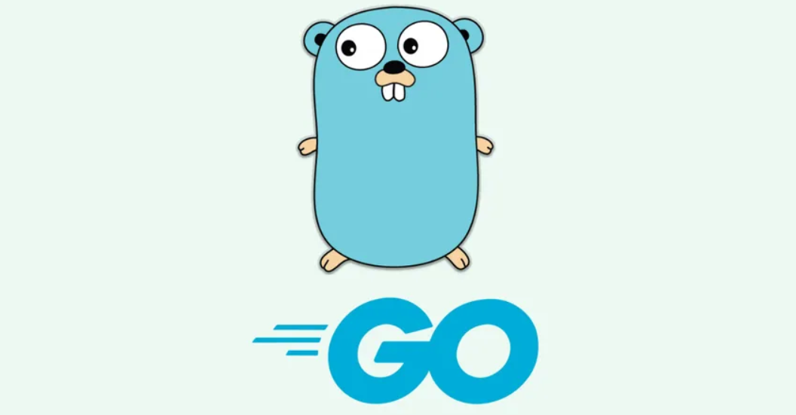

## AWS S3 File Downloader 🚀 

This Go script allows you to download specific files from an AWS S3 bucket. It's designed to be simple and efficient, leveraging the power of the AWS SDK for Go.

## Prerequisites 📦 


-Go installed on your machine.
-AWS credentials set up either in ~/.aws/credentials or as environment variables.
ğŸ› ï¸ ## Installation

1. Clone this repository:
bash
Copy code
git clone <your-repo-link>
Navigate to the directory:
bash
Copy code
cd <your-repo-directory>
Install the necessary Go packages:
bash
Copy code
go mod tidy
🚀 Usage
Open the download_data.go file and set your desired AWS region and S3 bucket name.
Run the script:
bash
Copy code
go run download_data.go
The files will be downloaded to the current directory.
📜 Code Explanation
The script starts by creating an AWS session using shared credentials or


Certainly! Below is a markdown file that you can use as a README for your Go project. It includes a brief introduction, prerequisites, installation instructions, usage, and a code explanation.


# AWS S3 File Downloader written in golang 📦



This Go project provides a simple and efficient way to download files from an Amazon S3 bucket. It leverages the AWS SDK for Go to interact with S3 and download specified files.


## Prerequisites 📋

- Go 1.20 or higher
- AWS account with access to S3
- AWS credentials configured (either through environment variables or shared credentials file)

## Installation 🛠ï¸

1. Clone the repository:

   ```bash
   git clone https://github.com/Adesoji1/s3-file-downloader.git

   ```

2. Navigate to the project directory:

   ```bash
   cd s3-file-downloader/goerl
   ```

3. Install the required dependencies:

```bash
   go mod init 
   ```

   ```bash
   go mod tidy
   ```

## Usage 🚀

1. Modify the `bucketName` and `files` variables in `download_data.go` to match your S3 bucket and the files you want to download.

2. Run the program:

   ```bash
   go run download_data.go
   ```

## Code Explanation 🧠

- **AWS Session**: The code creates an AWS session using shared credentials or environment variables.

- **S3 Client and Downloader**: An S3 client is created, followed by a downloader that leverages the client to download files.

- **File Download Loop**: The code iterates through a list of specified files, creating a local file for each, and then downloading the corresponding file from S3.

- **Error Handling**: Proper error handling is implemented to gracefully handle any issues that may arise during the download process.

## Contributing ğŸ¤

Feel free to fork the project, make changes, and submit a pull request. Contributions are welcome!

## License 📄

This project is licensed under the MIT License - see the [LICENSE.md](LICENSE.md) file for details.

## Acknowledgments ğŸ™

- AWS SDK for Go
- All the contributors who make open-source such a beautiful place!

---

Made with â¤ï¸ by [Adesoji Alu](https://github.com/Adesoji1)


